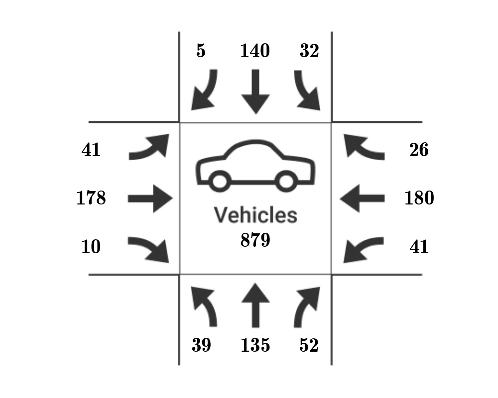
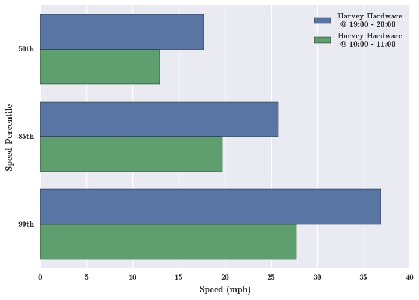

# SantosGUI

SantosGUI is a desktop application that interfaces with [SantosCloud](https://github.com/santosfamilyfoundation/SantosCloud) in order to analyze videos of intersections and produce traffic safety metrics.

SantosGUI allows users to create projects, upload videos, and configure projects, in order to have intersections of interest analyzed. This GUI makes the appropriate API calls to SantosCloud in order to have videos analyzed, and then displays the results of the analysis to the user.

SantosGUI is currently supported on modern versions of Windows, macOS, and 64-bit Ubuntu.

## Project Information

For more information on this project, its uses, and more, see our website at http://santostraffic.com.

## Documentation

[The project's wiki](https://github.com/santosfamilyfoundation/SantosGUI/wiki) contains project documentation, including installation instructions, usage guides, and other information.

## Questions?

You can reach out to contributors and maintainers of the project through our [Google Group](https://groups.google.com/d/forum/santos-traffic).

## Bugs and Issues

Please report bugs and issues with the software using the [issues page](https://github.com/santosfamilyfoundation/SantosGUI/issues).

## Results

SantosGUI allows you to take your video and have cars, bicycles, and pedestrians tracked by our SantosCloud platform, and display safety metrics for your intersection.

Using SantosGUI allows objects in your video to be tracked.

SantosGUI will give you counts of cars, bikes, and pedestrians.

You can also view a distribution of the speeds of the cars at the intersection.

Our software tracks the turning motions of cars to show you the amount of turns cars are taking at the intersection.

You can use our software to compare an intersection's speeds at different times of the day.

